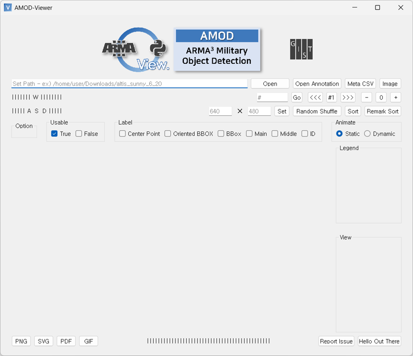
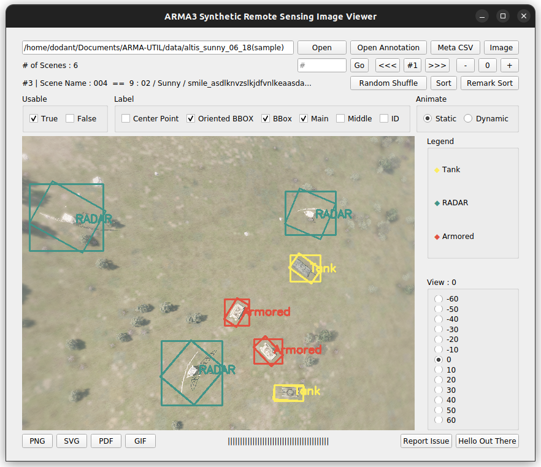
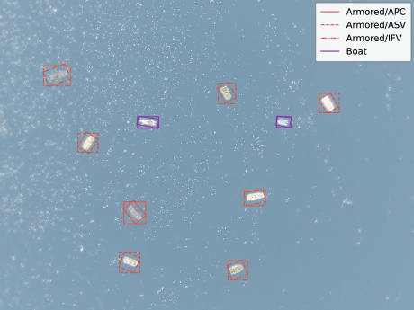
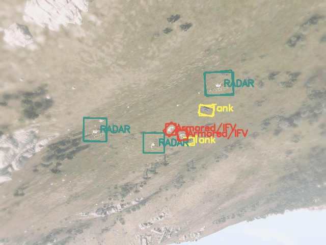

<div align="center">
    
</div>

<hr>

<h3 align="center">
 🎨 Viewer for Dataset
</h3>

<p align="center">
  <a href="#"></a>
  <a href="#"></a>
  <a href="./blob/main/LICENSE"></a>
</p>

<hr>

<p align="center">
  Correspondence to 
  <b>Junggyun Oh</b>, <b>Yechan Kim,</b> and <b>SungHeon Kim</b>
</p>

### This repo includes:
- Viewer for AMOD dataset series

<p float="center">
  
  
</p>

<!--
<br>[Download Latest ARMA Image Viewer Here](https://github.com/Dodant/arma-rs-utils/releases)
-->

### Features
- Load and display scenes with horizontal / rotated bounding boxes
- Allow saving images in various formats containing `.png`, `.svg`, `.pdf`
- Allow saving animated images in the `.gif` format

<p float="center">
  
  
</p>

### Quick start

1. Clone this repo and install requirements (`pip install -r requirements.txt`)
2. Run the code: `python src/armaviewer.py`
3. Open the dataset with its absolute path
   - Type the dataset path in the address bar
   - Click the `Open` button
4. Navigate the dataset with our viewer

<!--
## Correction Tool (Ver 1.1.2)

[Download ARMA Latest Correction Tool Here](https://github.com/Dodant/arma-rs-utils/releases/tag/corrector_v1.1.1)
<br>[Download ARMA Dataset Sample Here](https://github.com/Dodant/arma-rs-utils/tree/main/data/bbox_check_230410%20(sample))
-->

### Requirements
```
# python 3.8
pyqt5==5.13.0
opencv-contrib-python==4.8.0.76
pandas==2.0.3
matplotlib==3.7.2
qimage2ndarray==1.10.0
imageio==2.31.3
numpy==1.21.6
```

### Citation
- Paper is coming soon!


### Contribution
- If you find any bugs for further improvements, please feel free to create issues on GitHub!
- All contributions and suggestions are welcome. Of course, stars (🌟) are always welcome.
